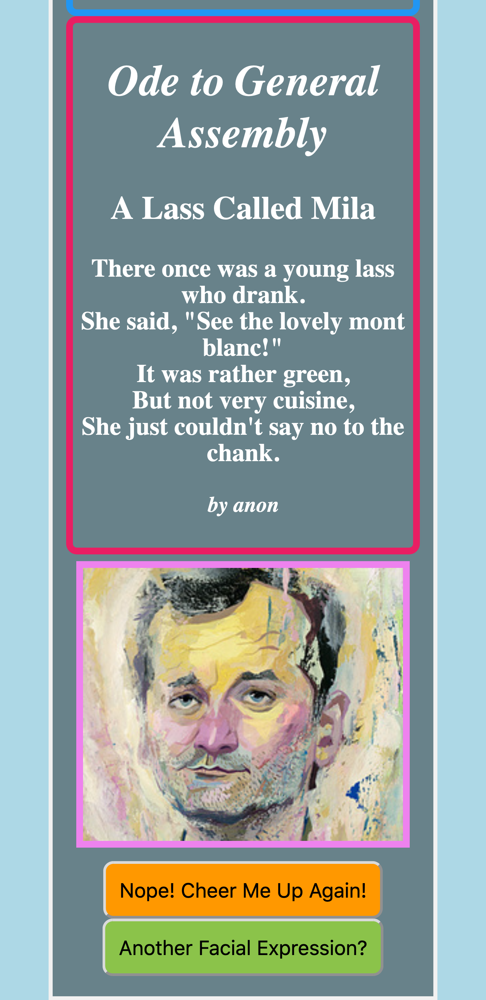

# Humor Poems API for GA SEI 31

## MongoDB Atlas using Spring Framework (Java) REST Service

### Deployed in Heroku: [GA SEI 31 Poems API](https://guarded-depths-85916.herokuapp.com/poem/random)

#### Usage: Select API Link above. Refresh browser to get a random poem.

#### API used in [Cheer-Me-App (Live)](https://cheer-me-app.herokuapp.com/) Project, 'Ode to General Assembly' section

#### More Details in [Cheer-Me-App in GitHub](https://github.com/mmborres/cheer-me-app)

### Random Poem (Responsive screen)

